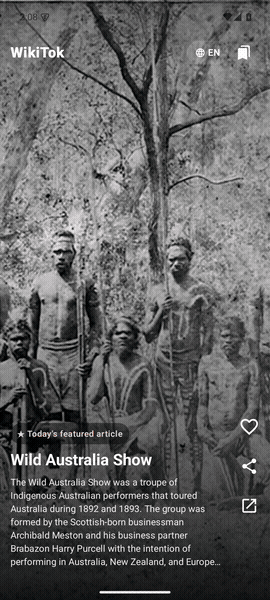
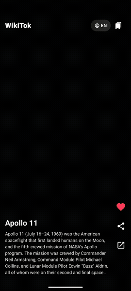
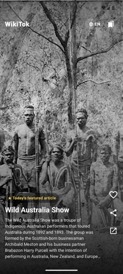
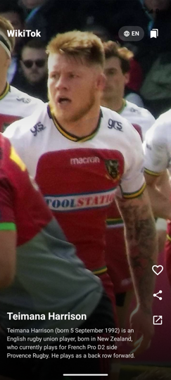
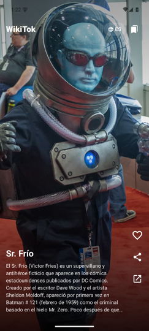

# WikiTok for Android

A native Android port of [WikiTok](https://www.wikitokapp.com/) — a TikTok-style
vertical feed of Wikipedia articles. Swipe up for the next article; the more you
like, the smarter the feed gets.

<p align="center">
  
  
</p>

<p align="center">
  
  
  
  
</p>

## Features

- **Endless vertical feed** of Wikipedia articles (Compose `VerticalPager`),
  full-bleed lead images with a gradient scrim. Articles without an image get
  deterministic gradient art generated from the title (plus `pilicense=any`,
  which roughly doubles image coverage by including non-free lead images).
- **On-device recommender, Monolith-shaped**: two-stage like TikTok's
  [Monolith](https://arxiv.org/abs/2209.07663), sized for a phone. Candidate
  generation alternates random batches with CirrusSearch `morelike:` batches
  seeded from your liked articles; ranking embeds each candidate with
  all-MiniLM-L6-v2 (int8 ONNX, ~23MB, downloaded on first engagement) and
  scores it against a user profile vector — a decaying weighted sum of
  embeddings from explicit likes (strong) and implicit signals: dwell time
  and expanding an extract (weak, dense) — with ε-greedy exploration slots
  so the feed never collapses into a bubble. Like *Apollo 11* and the next
  batch ranks *Neil Armstrong* on top; that's the whole idea.
- **Instant video**: articles with Wikimedia Commons videos autoplay them
  (muted, looping) the moment the card becomes current, via ExoPlayer and the
  TimedMediaHandler transcode derivatives.
- **Gestures**: tap to expand the full extract, double-tap to like (with the
  obligatory heart burst), long-press to share.
- **Daily highlight**: Wikipedia's featured article of the day as a badged card.
- **Digest notifications**: twice a day (WorkManager, 12h cadence), a
  recommender-ranked pick — or the daily featured article before you have a
  profile — as a big-picture notification; tapping opens the app on that
  article. Test hook: `--ez notify_now true`.
- **Save, share, open**: heart persists to DataStore, share sheet, open in browser.
- **10 languages, simultaneously**: pick any set of Wikipedia editions; each
  batch fetches from all of them in parallel and interleaves round-robin so
  the feed mixes languages card by card. Digest notifications rotate through
  the selection. (Note: the embedding model is English-tuned, so cross-language
  personalization is approximate for non-Latin scripts.)

## Building (nix)

Everything — Android SDK, emulator, gradle, JDK — comes from the flake:

```sh
nix develop -c gradle assembleDebug
# APK at app/build/outputs/apk/debug/app-debug.apk
```

CI (`.github/workflows/release.yml`) builds with the Gradle wrapper on
ubuntu-latest and attaches the APK to a GitHub Release on `v*` tags.

## Running in the headless emulator

```sh
nix develop
avdmanager create avd -n wikitok -k 'system-images;android-35;google_apis;arm64-v8a' -d pixel_7
emulator -avd wikitok -no-window -no-audio -no-boot-anim -gpu swiftshader_indirect &
adb wait-for-device
adb install app/build/outputs/apk/debug/app-debug.apk
adb shell am start -n com.novalinium.wikitok/.MainActivity
# deterministic feed for testing (skips the daily card):
adb shell 'am start -n com.novalinium.wikitok/.MainActivity --es debug_titles "Apollo 11|Tornado"'
adb exec-out screencap -p > screen.png
```

## Wikimedia gotchas learned the hard way

- `upload.wikimedia.org` returns **403** for image requests without an
  identifying `User-Agent` — Coil needs a custom `ImageLoader`.
- The same host returns **429** for video requests from `HttpURLConnection`
  *even with a good UA* (client-stack fingerprinting); media3 needs
  `OkHttpDataSource` instead of its default HTTP stack.
- `pageimages` only returns free images unless you pass `pilicense=any`.
